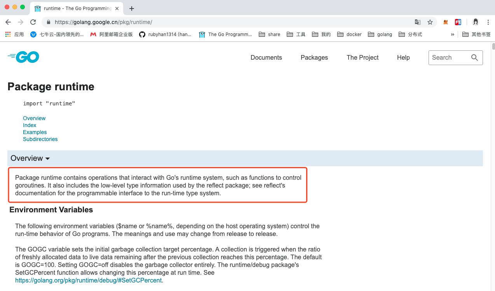

# runtime包

> @author：韩茹
>
> 版权所有：北京千锋互联科技有限公司

官网文档对runtime包的介绍：

```
Package runtime contains operations that interact with Go's runtime system, such as functions to control goroutines. It also includes the low-level type information used by the reflect package; see reflect's documentation for the programmable interface to the run-time type system.
```




尽管 Go 编译器产生的是本地可执行代码，这些代码仍旧运行在 Go 的 runtime（这部分的代码可以在 runtime 包中找到）当中。这个 runtime 类似 Java 和 .NET 语言所用到的虚拟机，它负责管理包括内存分配、垃圾回收（第 10.8 节）、栈处理、goroutine、channel、切片（slice）、map 和反射（reflection）等等。

## 一、常用函数

**`runtime` 调度器是个非常有用的东西，关于 `runtime` 包几个方法:**

- **NumCPU**：返回当前系统的 `CPU` 核数量

- **GOMAXPROCS**：设置最大的可同时使用的 `CPU` 核数

  通过runtime.GOMAXPROCS函数，应用程序何以在运行期间设置运行时系统中得P最大数量。但这会引起“Stop the World”。所以，应在应用程序最早的调用。并且最好是在运行Go程序之前设置好操作程序的环境变量GOMAXPROCS，而不是在程序中调用runtime.GOMAXPROCS函数。

  无论我们传递给函数的整数值是什么值，运行时系统的P最大值总会在1~256之间。

> go1.8后，默认让程序运行在多个核上,可以不用设置了
> go1.8前，还是要设置一下，可以更高效的利益cpu


- **Gosched**：让当前线程让出 `cpu` 以让其它线程运行,它不会挂起当前线程，因此当前线程未来会继续执行

  这个函数的作用是让当前 `goroutine` 让出 `CPU`，当一个 `goroutine` 发生阻塞，`Go` 会自动地把与该 `goroutine` 处于同一系统线程的其他 `goroutine` 转移到另一个系统线程上去，以使这些 `goroutine` 不阻塞。

- **Goexit**：退出当前 `goroutine`(但是`defer`语句会照常执行)

- **NumGoroutine**：返回正在执行和排队的任务总数

  runtime.NumGoroutine函数在被调用后，会返回系统中的处于特定状态的Goroutine的数量。这里的特指是指Grunnable\Gruning\Gsyscall\Gwaition。处于这些状态的Groutine即被看做是活跃的或者说正在被调度。

  注意：垃圾回收所在Groutine的状态也处于这个范围内的话，也会被纳入该计数器。

- **GOOS**：目标操作系统

- **runtime.GC**:会让运行时系统进行一次强制性的垃圾收集

  1. 强制的垃圾回收：不管怎样，都要进行的垃圾回收。
  2. 非强制的垃圾回收：只会在一定条件下进行的垃圾回收（即运行时，系统自上次垃圾回收之后新申请的堆内存的单元（也成为单元增量）达到指定的数值）。

- **GOROOT** :获取goroot目录

- **GOOS** : 查看目标操作系统 
  很多时候，我们会根据平台的不同实现不同的操作，就而已用GOOS了：

- 。。。


## 二、示例代码：

1. 获取goroot和os：

 ```go
   //获取goroot目录：
   	fmt.Println("GOROOT-->",runtime.GOROOT())
   
   	//获取操作系统
   	fmt.Println("os/platform-->",runtime.GOOS) // GOOS--> darwin，mac系统
   
 ```

   

2. 获取CPU数量，和设置CPU数量：

```go
func init(){
	//1.获取逻辑cpu的数量
	fmt.Println("逻辑CPU的核数：",runtime.NumCPU())
	//2.设置go程序执行的最大的：[1,256]
	n := runtime.GOMAXPROCS(runtime.NumCPU())
	fmt.Println(n)
}
```


3. Gosched()：

```go
func main() {
	go func() {
		for i := 0; i < 5; i++ {
			fmt.Println("goroutine。。。")
		}

	}()

	for i := 0; i < 4; i++ {
		//让出时间片，先让别的协议执行，它执行完，再回来执行此协程
		runtime.Gosched()
		fmt.Println("main。。")
	}
}

```


4. Goexit的使用（终止协程）

```go

func main() {
	//创建新建的协程
	go func() {
		fmt.Println("goroutine开始。。。")

		//调用了别的函数
		fun()

		fmt.Println("goroutine结束。。")
	}() //别忘了()

	//睡一会儿，不让主协程结束
	time.Sleep(3*time.Second)
}


func fun() {
	defer fmt.Println("defer。。。")

	//return           //终止此函数
	runtime.Goexit() //终止所在的协程

	fmt.Println("fun函数。。。")
}
```


千锋Go语言的学习群：784190273

github知识库：

https://github.com/rubyhan1314

作者B站：

https://space.bilibili.com/353694001

对应视频地址：

https://www.bilibili.com/video/av56018934

https://www.bilibili.com/video/av47467197

源代码：

https://github.com/rubyhan1314/go_goroutine


