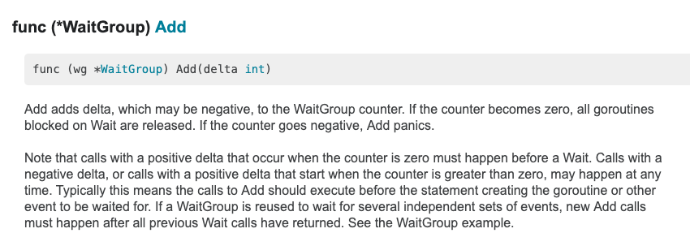
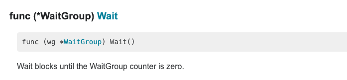
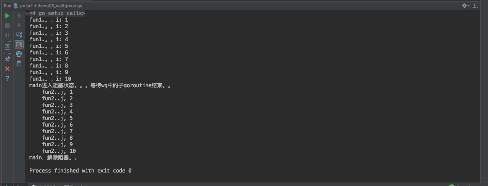

# sync包——WaitGroup

> @author：韩茹
>
> 版权所有：北京千锋互联科技有限公司

官网文档对sync包的介绍：

```
Package sync provides basic synchronization primitives such as mutual exclusion locks. Other than the Once and WaitGroup types, most are intended for use by low-level library routines. Higher-level synchronization is better done via channels and communication.
```


sync是synchronization同步这个词的缩写，所以也会叫做同步包。这里提供了基本同步的操作，比如互斥锁等等。这里除了Once和WaitGroup类型之外，大多数类型都是供低级库例程使用的。更高级别的同步最好通过channel通道和communication通信来完成


## 一、WaitGroup

WaitGroup，同步等待组。

在类型上，它是一个结构体。一个WaitGroup的用途是等待一个goroutine的集合执行完成。主goroutine调用了Add()方法来设置要等待的goroutine的数量。然后，每个goroutine都会执行并且执行完成后调用Done()这个方法。与此同时，可以使用Wait()方法来阻塞，直到所有的goroutine都执行完成。


## 二、Add()方法：

Add这个方法，用来设置到WaitGroup的计数器的值。我们可以理解为每个waitgroup中都有一个计数器
用来表示这个同步等待组中要执行的goroutin的数量。

如果计数器的数值变为0，那么就表示等待时被阻塞的goroutine都被释放，如果计数器的数值为负数，那么就会引发恐慌，程序就报错了。




## 三、Done()方法

Done()方法，就是当WaitGroup同步等待组中的某个goroutine执行完毕后，设置这个WaitGroup的counter数值减1。


其实Done()的底层代码就是调用了Add()方法：

```go
// Done decrements the WaitGroup counter by one.
func (wg *WaitGroup) Done() {
	wg.Add(-1)
}
```


## 四、Wait()方法

Wait()方法，表示让当前的goroutine等待，进入阻塞状态。一直到WaitGroup的计数器为零。才能解除阻塞，
这个goroutine才能继续执行。




## 五、示例代码：

我们创建并启动两个goroutine，来打印数字和字母，并在main goroutine中，将这两个子goroutine加入到一个WaitGroup中，同时让main goroutine进入Wait()，让两个子goroutine先执行。当每个子goroutine执行完毕后，调用Done()方法，设置WaitGroup的counter减1。当两条子goroutine都执行完毕后，WaitGroup中的counter的数值为零，解除main goroutine的阻塞。

示例代码：

```go
package main

import (
	"fmt"
	"sync"
)
var wg sync.WaitGroup // 创建同步等待组对象
func main()  {
	/*
	WaitGroup：同步等待组
		可以使用Add(),设置等待组中要 执行的子goroutine的数量，
		
		在main 函数中，使用wait(),让主程序处于等待状态。直到等待组中子程序执行完毕。解除阻塞

		子gorotuine对应的函数中。wg.Done()，用于让等待组中的子程序的数量减1
	 */
	//设置等待组中，要执行的goroutine的数量
	wg.Add(2)
	go fun1()
	go fun2()
	fmt.Println("main进入阻塞状态。。。等待wg中的子goroutine结束。。")
	wg.Wait() //表示main goroutine进入等待，意味着阻塞
	fmt.Println("main，解除阻塞。。")

}
func fun1()  {
	for i:=1;i<=10;i++{
		fmt.Println("fun1.。。i:",i)
	}
	wg.Done() //给wg等待中的执行的goroutine数量减1.同Add(-1)
}
func fun2()  {
	defer wg.Done()
	for j:=1;j<=10;j++{
		fmt.Println("\tfun2..j,",j)
	}
}


```

运行结果：




```
GOROOT=/usr/local/go #gosetup
GOPATH=/Users/ruby/go #gosetup
/usr/local/go/bin/go build -i -o /private/var/folders/kt/nlhsnpgn6lgd_q16f8j83sbh0000gn/T/___go_build_demo05_waitgroup_go /Users/ruby/go/src/l_goroutine/demo05_waitgroup.go #gosetup
/private/var/folders/kt/nlhsnpgn6lgd_q16f8j83sbh0000gn/T/___go_build_demo05_waitgroup_go #gosetup
fun1.。。i: 1
fun1.。。i: 2
fun1.。。i: 3
fun1.。。i: 4
fun1.。。i: 5
fun1.。。i: 6
fun1.。。i: 7
fun1.。。i: 8
fun1.。。i: 9
fun1.。。i: 10
main进入阻塞状态。。。等待wg中的子goroutine结束。。
	fun2..j, 1
	fun2..j, 2
	fun2..j, 3
	fun2..j, 4
	fun2..j, 5
	fun2..j, 6
	fun2..j, 7
	fun2..j, 8
	fun2..j, 9
	fun2..j, 10
main，解除阻塞。。

Process finished with exit code 0

```


千锋Go语言的学习群：784190273

github知识库：

https://github.com/rubyhan1314

作者B站：

https://space.bilibili.com/353694001

对应视频地址：

https://www.bilibili.com/video/av56018934

https://www.bilibili.com/video/av47467197

源代码：

https://github.com/rubyhan1314/go_goroutine


