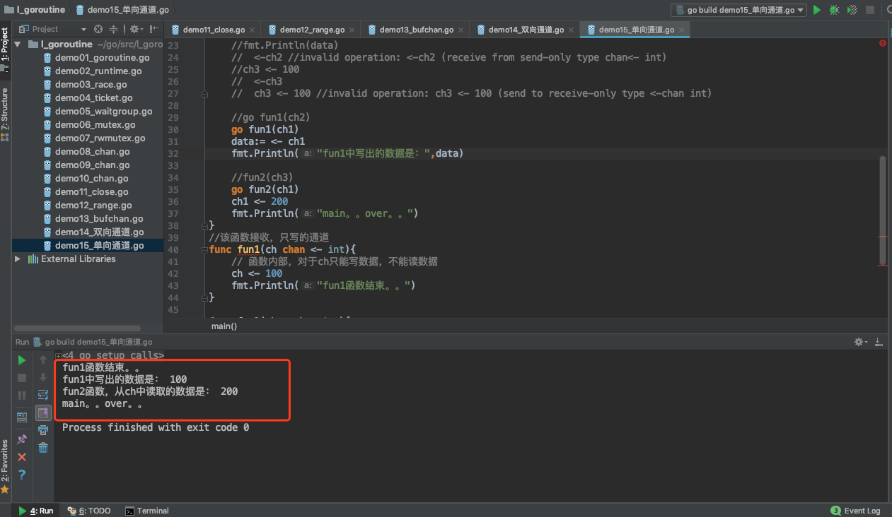

# 定向通道

> @author：韩茹
>
> 版权所有：北京千锋互联科技有限公司


## 一、双向通道

通道，channel，是用于实现goroutine之间的通信的。一个goroutine可以向通道中发送数据，另一条goroutine可以从该通道中获取数据。截止到现在我们所学习的通道，都是既可以发送数据，也可以读取数据，我们又把这种通道叫做双向通道。

```go
data := <- a // read from channel a  
a <- data // write to channel a
```


## 二、单向通道

单向通道，也就是定向通道。

之前我们学习的通道都是双向通道，我们可以通过这些通道接收或者发送数据。我们也可以创建单向通道，这些通道只能发送或者接收数据。


双向通道，实例代码：

```go
package main

import "fmt"

func main()  {
	/*
	双向：
		chan T -->
			chan <- data,写出数据，写
			data <- chan,获取数据，读
	单向：定向
		chan <- T,
			只支持写，
		<- chan T,
			只读
	 */
	ch1 := make(chan string) // 双向，可读，可写
	done := make(chan bool)
	go sendData(ch1, done)
	data :=<- ch1 //阻塞
	fmt.Println("子goroutine传来：", data)
	ch1 <- "我是main。。" // 阻塞

	<-done
	fmt.Println("main...over....")
}
//子goroutine-->写数据到ch1通道中
//main goroutine-->从ch1通道中取
func sendData(ch1 chan string, done chan bool)  {
	ch1 <- "我是小明"// 阻塞
	data := <-ch1 // 阻塞
	fmt.Println("main goroutine传来：",data)

	done <- true
}

```

运行结果：


创建仅能发送数据的通道，示例代码：

示例代码：

```go
package main

import "fmt"

func main()  {
	/*
		单向：定向
		chan <- T,
			只支持写，
		<- chan T,
			只读


		用于参数传递：
	 */
	ch1 := make(chan int)//双向，读，写
	//ch2 := make(chan <- int) // 单向，只写，不能读
	//ch3 := make(<- chan int) //单向，只读，不能写
	//ch1 <- 100
	//data :=<-ch1
	//ch2 <- 1000
	//data := <- ch2
	//fmt.Println(data)
	//	<-ch2 //invalid operation: <-ch2 (receive from send-only type chan<- int)
	//ch3 <- 100
	//	<-ch3
	//	ch3 <- 100 //invalid operation: ch3 <- 100 (send to receive-only type <-chan int)

	//go fun1(ch2)
	go fun1(ch1)
	data:= <- ch1
	fmt.Println("fun1中写出的数据是：",data)

	//fun2(ch3)
	go fun2(ch1)
	ch1 <- 200
	fmt.Println("main。。over。。")
}
//该函数接收，只写的通道
func fun1(ch chan <- int){
	// 函数内部，对于ch只能写数据，不能读数据
	ch <- 100
	fmt.Println("fun1函数结束。。")
}

func fun2(ch <-chan int){
	//函数内部，对于ch只能读数据，不能写数据
	data := <- ch
	fmt.Println("fun2函数，从ch中读取的数据是：",data)
}

```

运行结果：




千锋Go语言的学习群：784190273

github知识库：

https://github.com/rubyhan1314

Golang网址：

https://www.qfgolang.com/


作者B站：

https://space.bilibili.com/353694001

对应视频地址：

https://www.bilibili.com/video/av56018934

https://www.bilibili.com/video/av47467197

源代码：

https://github.com/rubyhan1314/go_goroutine


