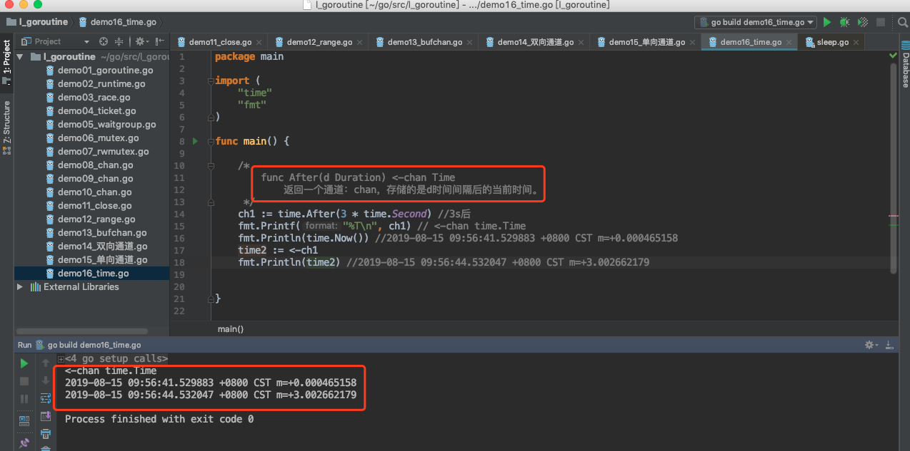

# time包中的通道相关函数

> @author：韩茹
>
> 版权所有：北京千锋互联科技有限公司


主要就是定时器，标准库中的Timer让用户可以定义自己的超时逻辑，尤其是在应对select处理多个channel的超时、单channel读写的超时等情形时尤为方便。

Timer是一次性的时间触发事件，这点与Ticker不同，Ticker是按一定时间间隔持续触发时间事件。

Timer常见的创建方式：

```go
t:= time.NewTimer(d)
t:= time.AfterFunc(d, f)
c:= time.After(d)
```

虽然说创建方式不同，但是原理是相同的。

Timer有3个要素：

```go
定时时间：就是那个d
触发动作：就是那个f
时间channel： 也就是t.C
```


## 一、time.NewTimer()

NewTimer()创建一个新的计时器，该计时器将在其通道上至少持续d之后发送当前时间。


它的返回值是一个Timer。


源代码：

```go
// NewTimer creates a new Timer that will send
// the current time on its channel after at least duration d.
func NewTimer(d Duration) *Timer {
	c := make(chan Time, 1)
	t := &Timer{
		C: c,
		r: runtimeTimer{
			when: when(d),
			f:    sendTime,
			arg:  c,
		},
	}
	startTimer(&t.r)
	return t
}
```

通过源代码我们可以看出，首先创建一个channel，关联的类型为Time，然后创建了一个Timer并返回。

- 用于在指定的Duration类型时间后调用函数或计算表达式。
- 如果只是想指定时间之后执行,使用time.Sleep()
- 使用NewTimer(),可以返回的Timer类型在计时器到期之前,取消该计时器
- 直到使用<-timer.C发送一个值,该计时器才会过期


示例代码：

```go
package main

import (
	"time"
	"fmt"
)

func main() {

	/*
		1.func NewTimer(d Duration) *Timer
			创建一个计时器：d时间以后触发，go触发计时器的方法比较特别，就是在计时器的channel中发送值
	 */
	//新建一个计时器：timer
	timer := time.NewTimer(3 * time.Second)
	fmt.Printf("%T\n", timer) //*time.Timer
	fmt.Println(time.Now())   //2019-08-15 10:41:21.800768 +0800 CST m=+0.000461190

	//此处在等待channel中的信号，执行此段代码时会阻塞3秒
	ch2 := timer.C     //<-chan time.Time
	fmt.Println(<-ch2) //2019-08-15 10:41:24.803471 +0800 CST m=+3.003225965

}

```

运行结果：


## 二、timer.Stop

计时器停止：


示例代码：

```go
package main

import (
	"time"
	"fmt"
)

func main() {

	/*
		1.func NewTimer(d Duration) *Timer
			创建一个计时器：d时间以后触发，go触发计时器的方法比较特别，就是在计时器的channel中发送值
	 */
	//新建一个计时器：timer
	//timer := time.NewTimer(3 * time.Second)
	//fmt.Printf("%T\n", timer) //*time.Timer
	//fmt.Println(time.Now())   //2019-08-15 10:41:21.800768 +0800 CST m=+0.000461190
	//
	////此处在等待channel中的信号，执行此段代码时会阻塞3秒
	//ch2 := timer.C     //<-chan time.Time
	//fmt.Println(<-ch2) //2019-08-15 10:41:24.803471 +0800 CST m=+3.003225965


	fmt.Println("-------------------------------")

	//新建计时器，一秒后触发

	timer2 := time.NewTimer(5 * time.Second)

	//新开启一个线程来处理触发后的事件

	go func() {

		//等触发时的信号

		<-timer2.C

		fmt.Println("Timer 2 结束。。")

	}()

	//由于上面的等待信号是在新线程中，所以代码会继续往下执行，停掉计时器

	time.Sleep(3*time.Second)
	stop := timer2.Stop()

	if stop {

		fmt.Println("Timer 2 停止。。")

	}

}

```

运行结果：


## 三、time.After()

在等待持续时间之后，然后在返回的通道上发送当前时间。它相当于NewTimer(d).C。在计时器触发之前，垃圾收集器不会恢复底层计时器。如果效率有问题，使用NewTimer代替，并调用Timer。如果不再需要计时器，请停止。


源码：

```go
// After waits for the duration to elapse and then sends the current time
// on the returned channel.
// It is equivalent to NewTimer(d).C.
// The underlying Timer is not recovered by the garbage collector
// until the timer fires. If efficiency is a concern, use NewTimer
// instead and call Timer.Stop if the timer is no longer needed.
func After(d Duration) <-chan Time {
	return NewTimer(d).C
}
```

示例代码：

```go
package main

import (
	"time"
	"fmt"
)

func main() {

	/*
		func After(d Duration) <-chan Time
			返回一个通道：chan，存储的是d时间间隔后的当前时间。
	 */
	ch1 := time.After(3 * time.Second) //3s后
	fmt.Printf("%T\n", ch1) // <-chan time.Time
	fmt.Println(time.Now()) //2019-08-15 09:56:41.529883 +0800 CST m=+0.000465158
	time2 := <-ch1
	fmt.Println(time2) //2019-08-15 09:56:44.532047 +0800 CST m=+3.002662179


}

```

运行结果：




千锋Go语言的学习群：784190273

github知识库：

https://github.com/rubyhan1314

Golang网址：

https://www.qfgolang.com/


作者B站：

https://space.bilibili.com/353694001

对应视频地址：

https://www.bilibili.com/video/av56018934

https://www.bilibili.com/video/av47467197

源代码：

https://github.com/rubyhan1314/go_goroutine


