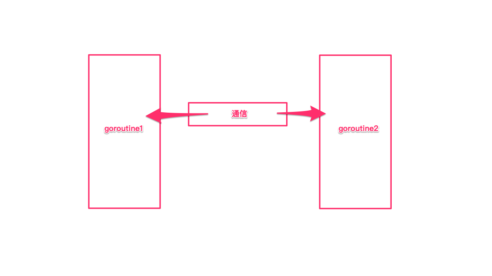

# Go语言的CSP模型

> @author：韩茹
>
> 版权所有：北京千锋互联科技有限公司


go语言的最大两个亮点，一个是goroutine，一个就是chan了。二者合体的典型应用CSP，基本就是大家认可的并行开发神器，简化了并行程序的开发难度，我们来看一下CSP。 


## 一、CSP是什么

CSP 是 Communicating Sequential Process 的简称，中文可以叫做通信顺序进程，是一种并发编程模型，是一个很强大的并发数据模型，是上个世纪七十年代提出的，用于描述两个独立的并发实体通过共享的通讯 channel(管道)进行通信的并发模型。相对于Actor模型，CSP中channel是第一类对象，它不关注发送消息的实体，而关注与发送消息时使用的channel。

严格来说，CSP 是一门形式语言（类似于 ℷ calculus），用于描述并发系统中的互动模式，也因此成为一众面向并发的编程语言的理论源头，并衍生出了 Occam/Limbo/Golang…

而具体到编程语言，如 Golang，其实只用到了 CSP 的很小一部分，即理论中的 Process/Channel（对应到语言中的 goroutine/channel）：这两个并发原语之间没有从属关系， Process 可以订阅任意个 Channel，Channel 也并不关心是哪个 Process 在利用它进行通信；Process 围绕 Channel 进行读写，形成一套有序阻塞和可预测的并发模型。


## 二、Golang CSP

与主流语言通过共享内存来进行并发控制方式不同，Go 语言采用了 CSP 模式。这是一种用于描述两个独立的并发实体通过共享的通讯 Channel（管道）进行通信的并发模型。

Golang 就是借用CSP模型的一些概念为之实现并发进行理论支持，其实从实际上出发，go语言并没有，完全实现了CSP模型的所有理论，仅仅是借用了 process和channel这两个概念。process是在go语言上的表现就是 goroutine 是实际并发执行的实体，每个实体之间是通过channel通讯来实现数据共享。


Go语言的CSP模型是由协程Goroutine与通道Channel实现：

- 
  Go协程goroutine: 是一种轻量线程，它不是操作系统的线程，而是将一个操作系统线程分段使用，通过调度器实现协作式调度。是一种绿色线程，微线程，它与Coroutine协程也有区别，能够在发现堵塞后启动新的微线程。
- 通道channel: 类似Unix的Pipe，用于协程之间通讯和同步。协程之间虽然解耦，但是它们和Channel有着耦合。

 


## 三、Channel

Goroutine 和 channel 是 Go 语言并发编程的 两大基石。Goroutine 用于执行并发任务，channel 用于 goroutine 之间的同步、通信。

Channel 在 gouroutine 间架起了一条管道，在管道里传输数据，实现 gouroutine 间的通信；由于它是线程安全的，所以用起来非常方便；channel 还提供 “先进先出” 的特性；它还能影响 goroutine 的阻塞和唤醒。

相信大家一定见过一句话：

> Do not communicate by sharing memory; instead, share memory by communicating.

不要通过共享内存来通信，而要通过通信来实现内存共享。

这就是 Go 的并发哲学，它依赖 CSP 模型，基于 channel 实现。


**channel 实现 CSP**

Channel 是 Go 语言中一个非常重要的类型，是 Go 里的第一对象。通过 channel，Go 实现了通过通信来实现内存共享。Channel 是在多个 goroutine 之间传递数据和同步的重要手段。

使用原子函数、读写锁可以保证资源的共享访问安全，但使用 channel 更优雅。

channel 字面意义是 “通道”，类似于 Linux 中的管道。声明 channel 的语法如下：

```go
chan T // 声明一个双向通道
chan<- T // 声明一个只能用于发送的通道
<-chan T // 声明一个只能用于接收的通道
```

单向通道的声明，用 `<-` 来表示，它指明通道的方向。你只要明白，代码的书写顺序是从左到右就马上能掌握通道的方向是怎样的。

因为 channel 是一个引用类型，所以在它被初始化之前，它的值是 nil，channel 使用 make 函数进行初始化。可以向它传递一个 int 值，代表 channel 缓冲区的大小（容量），构造出来的是一个缓冲型的 channel；不传或传 0 的，构造的就是一个非缓冲型的 channel。

两者有一些差别：非缓冲型 channel 无法缓冲元素，对它的操作一定顺序是 “发送 -> 接收 -> 发送 -> 接收 -> ……”，如果想连续向一个非缓冲 chan 发送 2 个元素，并且没有接收的话，第一次一定会被阻塞；对于缓冲型 channel 的操作，则要 “宽松” 一些，毕竟是带了 “缓冲” 光环。





对 chan 的发送和接收操作都会在编译期间转换成为底层的发送接收函数。

Channel 分为两种：带缓冲、不带缓冲。对不带缓冲的 channel 进行的操作实际上可以看作 “同步模式”，带缓冲的则称为 “异步模式”。

同步模式下，发送方和接收方要同步就绪，只有在两者都 ready 的情况下，数据才能在两者间传输（后面会看到，实际上就是内存拷贝）。否则，任意一方先行进行发送或接收操作，都会被挂起，等待另一方的出现才能被唤醒。

异步模式下，在缓冲槽可用的情况下（有剩余容量），发送和接收操作都可以顺利进行。否则，操作的一方（如写入）同样会被挂起，直到出现相反操作（如接收）才会被唤醒。

小结一下：同步模式下，必须要使发送方和接收方配对，操作才会成功，否则会被阻塞；异步模式下，缓冲槽要有剩余容量，操作才会成功，否则也会被阻塞。


简单来说，CSP 模型由并发执行的实体（线程或者进程或者协程）所组成，实体之间通过发送消息进行通信，
这里发送消息时使用的就是通道，或者叫 channel。

CSP 模型的关键是关注 channel，而不关注发送消息的实体。Go 语言实现了 CSP 部分理论，goroutine 对应 CSP 中并发执行的实体，channel 也就对应着 CSP 中的 channel。


## 四、Goroutine

Goroutine 是实际并发执行的实体，它底层是使用协程(coroutine)实现并发，coroutine是一种运行在用户态的用户线程，类似于 greenthread，go底层选择使用coroutine的出发点是因为，它具有以下特点：

- 用户空间 避免了内核态和用户态的切换导致的成本
- 可以由语言和框架层进行调度
- 更小的栈空间允许创建大量的实例


可以看到第二条 用户空间线程的调度不是由操作系统来完成的，像在java 1.3中使用的greenthread的是由JVM统一调度的(后java已经改为内核线程)，还有在ruby中的fiber(半协程) 是需要在重新中自己进行调度的，而goroutine是在golang层面提供了调度器，并且对网络IO库进行了封装，屏蔽了复杂的细节，对外提供统一的语法关键字支持，简化了并发程序编写的成本。


## 五、Goroutine 调度器

Go并发调度: G-P-M模型

在操作系统提供的内核线程之上，Go搭建了一个特有的两级线程模型。goroutine机制实现了M : N的线程模型，goroutine机制是协程（coroutine）的一种实现，golang内置的调度器，可以让多核CPU中每个CPU执行一个协程。


## 六、最后

Golang 的 channel 将 goroutine 隔离开，并发编程的时候可以将注意力放在 channel 上。在一定程度上，这个和消息队列的解耦功能还是挺像的。如果大家感兴趣，还是来看看 channel 的源码吧，对于更深入地理解 channel 还是挺有用的。

Go 通过 channel 实现 CSP 通信模型，主要用于 goroutine 之间的消息传递和事件通知。

有了 channel 和 goroutine 之后，Go 的并发编程变得异常容易和安全，得以让程序员把注意力留到业务上去，实现开发效率的提升。

要知道，技术并不是最重要的，它只是实现业务的工具。一门高效的开发语言让你把节省下来的时间，留着去做更有意义的事情，比如写写文章。


> CSP 最早是由 Tony Hoare在 1977 年提出，据说老爷子至今仍在更新这个理论模型，有兴趣的朋友可以自行查阅电子版本：http://www.usingcsp.com/cspbook.pdf。
>
> 


参考文档：https://learnku.com/articles/32142


千锋Go语言的学习群：784190273

github知识库：

https://github.com/rubyhan1314

Golang网址：

https://www.qfgolang.com/

作者B站：

https://space.bilibili.com/353694001

对应视频地址：

https://www.bilibili.com/video/av56018934

https://www.bilibili.com/video/av47467197

源代码：

https://github.com/rubyhan1314/go_goroutine


