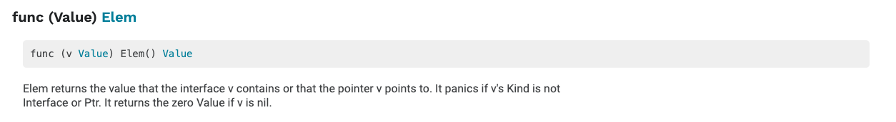

#反射reflect

## 一、反射的规则

其实反射的操作步骤非常的简单，就是通过实体对象获取反射对象(Value、Type)，然后操作相应的方法即可。

下图描述了实例、Value、Type 三者之间的转换关系：


反射 API 的分类总结如下：

**1) 从实例到 Value**

通过实例获取 Value 对象，直接使用 reflect.ValueOf() 函数。例如：

```go
func ValueOf(i interface {}) Value
```

**2) 从实例到 Type**

通过实例获取反射对象的 Type，直接使用 reflect.TypeOf() 函数。例如：

```go
func TypeOf(i interface{}) Type
```

**3) 从 Type 到 Value**

Type 里面只有类型信息，所以直接从一个 Type 接口变量里面是无法获得实例的 Value 的，但可以通过该 Type 构建一个新实例的 Value。reflect 包提供了两种方法，示例如下：

```go
//New 返回的是一个 Value，该 Value 的 type 为 PtrTo(typ)，即 Value 的 Type 是指定 typ 的指针类型
func New(typ Type) Value
//Zero 返回的是一个 typ 类型的零佳，注意返回的 Value 不能寻址，位不可改变
func Zero(typ Type) Value
```

如果知道一个类型值的底层存放地址，则还有一个函数是可以依据 type 和该地址值恢复出 Value 的。例如：

```go
func NewAt(typ Type, p unsafe.Pointer) Value
```

**4) 从 Value 到 Type**

从反射对象 Value 到 Type 可以直接调用 Value 的方法，因为 Value 内部存放着到 Type 类型的指针。例如：

```go
func (v Value) Type() Type
```


**5) 从 Value 到实例**

Value 本身就包含类型和值信息，reflect 提供了丰富的方法来实现从 Value 到实例的转换。例如：

```go
//该方法最通用，用来将 Value 转换为空接口，该空接口内部存放具体类型实例
//可以使用接口类型查询去还原为具体的类型
func (v Value) Interface() （i interface{})

//Value 自身也提供丰富的方法，直接将 Value 转换为简单类型实例，如果类型不匹配，则直接引起 panic
func (v Value) Bool () bool
func (v Value) Float() float64
func (v Value) Int() int64
func (v Value) Uint() uint64
```


**6) 从 Value 的指针到值**

从一个指针类型的 Value 获得值类型 Value 有两种方法，示例如下。

```go
//如果 v 类型是接口，则 Elem() 返回接口绑定的实例的 Value，如采 v 类型是指针，则返回指针值的 Value，否则引起 panic
func (v Value) Elem() Value
//如果 v 是指针，则返回指针值的 Value，否则返回 v 自身，该函数不会引起 panic
func Indirect(v Value) Value
```


**7) Type 指针和值的相互转换**

指针类型 Type 到值类型 Type。例如：

```go
//t 必须是 Array、Chan、Map、Ptr、Slice，否则会引起 panic
//Elem 返回的是其内部元素的 Type
t.Elem() Type
```


值类型 Type 到指针类型 Type。例如：

```go
//PtrTo 返回的是指向 t 的指针型 Type
func PtrTo(t Type) Type
```


**8) Value 值的可修改性**

Value 值的修改涉及如下两个方法：

```go
//通过 CanSet 判断是否能修改
func (v Value ) CanSet() bool
//通过 Set 进行修改
func (v Value ) Set(x Value)
```


Value 值在什么情况下可以修改？我们知道实例对象传递给接口的是一个完全的值拷贝，如果调用反射的方法 reflect.ValueOf() 传进去的是一个值类型变量， 则获得的 Value 实际上是原对象的一个副本，这个 Value 是无论如何也不能被修改的。

**根据 Go 官方关于反射的博客，反射有三大定律：**

> 1. Reflection goes from interface value to reflection object.
> 2. Reflection goes from reflection object to interface value.
> 3. To modify a reflection object, the value must be settable.

第一条是最基本的：反射可以从接口值得到反射对象。

​		反射是一种检测存储在 interface中的类型和值机制。这可以通过 TypeOf函数和 ValueOf函数得到。

第二条实际上和第一条是相反的机制，反射可以从反射对象获得接口值。

​		它将 ValueOf的返回值通过 Interface()函数反向转变成 interface变量。

前两条就是说 接口型变量和 反射类型对象可以相互转化，反射类型对象实际上就是指的前面说的 reflect.Type和 reflect.Value。

第三条不太好懂：如果需要操作一个反射变量，则其值必须可以修改。

​		反射变量可设置的本质是它存储了原变量本身，这样对反射变量的操作，就会反映到原变量本身；反之，如果反射变量不能代表原变量，那么操作了反射变量，不会对原变量产生任何影响，这会给使用者带来疑惑。所以第二种情况在语言层面是不被允许的。


## 二、反射的使用

### 3.1 从relfect.Value中获取接口interface的信息

当执行reflect.ValueOf(interface)之后，就得到了一个类型为”relfect.Value”变量，可以通过它本身的Interface()方法获得接口变量的真实内容，然后可以通过类型判断进行转换，转换为原有真实类型。不过，我们可能是已知原有类型，也有可能是未知原有类型，因此，下面分两种情况进行说明。

#### 已知原有类型

已知类型后转换为其对应的类型的做法如下，直接通过Interface方法然后强制转换，如下：

```go
realValue := value.Interface().(已知的类型)
```

示例代码：

```go
package main

import (
	"fmt"
	"reflect"
)

func main() {
	var num float64 = 1.2345

	pointer := reflect.ValueOf(&num)
	value := reflect.ValueOf(num)

	// 可以理解为“强制转换”，但是需要注意的时候，转换的时候，如果转换的类型不完全符合，则直接panic
	// Golang 对类型要求非常严格，类型一定要完全符合
	// 如下两个，一个是*float64，一个是float64，如果弄混，则会panic
	convertPointer := pointer.Interface().(*float64)
	convertValue := value.Interface().(float64)

	fmt.Println(convertPointer)
	fmt.Println(convertValue)
}
```

运行结果：

```
0xc000098000
1.2345
```

说明

1. 转换的时候，如果转换的类型不完全符合，则直接panic，类型要求非常严格！
2. 转换的时候，要区分是指针还是指
3. 也就是说反射可以将“反射类型对象”再重新转换为“接口类型变量”


#### 未知原有类型

很多情况下，我们可能并不知道其具体类型，那么这个时候，该如何做呢？需要我们进行遍历探测其Filed来得知，示例如下:

```go
package main

import (
	"fmt"
	"reflect"
)


type Person struct {
	Name string
	Age int
	Sex string
}

func (p Person)Say(msg string)  {
	fmt.Println("hello，",msg)
}
func (p Person)PrintInfo()  {
	fmt.Printf("姓名：%s,年龄：%d，性别：%s\n",p.Name,p.Age,p.Sex)
}


func main() {
	p1 := Person{"王二狗",30,"男"}

	DoFiledAndMethod(p1)

}

// 通过接口来获取任意参数
func DoFiledAndMethod(input interface{}) {

	getType := reflect.TypeOf(input) //先获取input的类型
	fmt.Println("get Type is :", getType.Name()) // Person
	fmt.Println("get Kind is : ", getType.Kind()) // struct

	getValue := reflect.ValueOf(input)
	fmt.Println("get all Fields is:", getValue) //{王二狗 30 男}

	// 获取方法字段
	// 1. 先获取interface的reflect.Type，然后通过NumField进行遍历
	// 2. 再通过reflect.Type的Field获取其Field
	// 3. 最后通过Field的Interface()得到对应的value
	for i := 0; i < getType.NumField(); i++ {
		field := getType.Field(i)
		value := getValue.Field(i).Interface() //获取第i个值
		fmt.Printf("字段名称:%s, 字段类型:%s, 字段数值:%v \n", field.Name, field.Type, value)
	}

	// 通过反射，操作方法
	// 1. 先获取interface的reflect.Type，然后通过.NumMethod进行遍历
	// 2. 再公国reflect.Type的Method获取其Method
	for i := 0; i < getType.NumMethod(); i++ {
		method := getType.Method(i)
		fmt.Printf("方法名称:%s, 方法类型:%v \n", method.Name, method.Type)
	}
}

```


运行结果：

```
get Type is : Person
get Kind is :  struct
get all Fields is: {王二狗 30 男}
字段名称:Name, 字段类型:string, 字段数值:王二狗 
字段名称:Age, 字段类型:int, 字段数值:30 
字段名称:Sex, 字段类型:string, 字段数值:男 
方法名称:PrintInfo, 方法类型:func(main.Person) 
方法名称:Say, 方法类型:func(main.Person, string) 
```


说明

通过运行结果可以得知获取未知类型的interface的具体变量及其类型的步骤为：

1. 先获取interface的reflect.Type，然后通过NumField进行遍历
2. 再通过reflect.Type的Field获取其Field
3. 最后通过Field的Interface()得到对应的value

通过运行结果可以得知获取未知类型的interface的所属方法（函数）的步骤为：

1. 先获取interface的reflect.Type，然后通过NumMethod进行遍历
2. 再分别通过reflect.Type的Method获取对应的真实的方法（函数）
3. 最后对结果取其Name和Type得知具体的方法名
4. 也就是说反射可以将“反射类型对象”再重新转换为“接口类型变量”
5. struct 或者 struct 的嵌套都是一样的判断处理方式


### 3.2 通过reflect.Value设置实际变量的值

reflect.Value是通过reflect.ValueOf(X)获得的，只有当X是指针的时候，才可以通过reflec.Value修改实际变量X的值，即：要修改反射类型的对象就一定要保证其值是“addressable”的。

这里需要一个方法：




解释起来就是：Elem返回接口v包含的值或指针v指向的值。如果v的类型不是interface或ptr，它会恐慌。如果v为零，则返回零值。


```
package main

import (
	"fmt"
	"reflect"
)

func main() {

	var num float64 = 1.2345
	fmt.Println("old value of pointer:", num)

	// 通过reflect.ValueOf获取num中的reflect.Value，注意，参数必须是指针才能修改其值
	pointer := reflect.ValueOf(&num)
	newValue := pointer.Elem()

	fmt.Println("type of pointer:", newValue.Type())
	fmt.Println("settability of pointer:", newValue.CanSet())

	// 重新赋值
	newValue.SetFloat(77)
	fmt.Println("new value of pointer:", num)

	////////////////////
	// 如果reflect.ValueOf的参数不是指针，会如何？
	//pointer = reflect.ValueOf(num)
	//newValue = pointer.Elem() // 如果非指针，这里直接panic，“panic: reflect: call of reflect.Value.Elem on float64 Value”
}

```

运行结果：

```
old value of pointer: 1.2345
type of pointer: float64
settability of pointer: true
new value of pointer: 77
```

说明

1. 需要传入的参数是* float64这个指针，然后可以通过pointer.Elem()去获取所指向的Value，**注意一定要是指针**。
2. 如果传入的参数不是指针，而是变量，那么
   - 通过Elem获取原始值对应的对象则直接panic
   - 通过CanSet方法查询是否可以设置返回false
3. newValue.CantSet()表示是否可以重新设置其值，如果输出的是true则可修改，否则不能修改，修改完之后再进行打印发现真的已经修改了。
4. reflect.Value.Elem() 表示获取原始值对应的反射对象，只有原始对象才能修改，当前反射对象是不能修改的
5. 也就是说如果要修改反射类型对象，其值必须是“addressable”【对应的要传入的是指针，同时要通过Elem方法获取原始值对应的反射对象】
6. struct 或者 struct 的嵌套都是一样的判断处理方式


### 3.3 通过reflect.ValueOf来进行方法的调用

这算是一个高级用法了，前面我们只说到对类型、变量的几种反射的用法，包括如何获取其值、其类型、如果重新设置新值。但是在工程应用中，另外一个常用并且属于高级的用法，就是通过reflect来进行方法【函数】的调用。比如我们要做框架工程的时候，需要可以随意扩展方法，或者说用户可以自定义方法，那么我们通过什么手段来扩展让用户能够自定义呢？关键点在于用户的自定义方法是未可知的，因此我们可以通过reflect来搞定


示例代码

```go
package main

import (
	"reflect"
	"fmt"
)

func main()  {
	//1.“接口类型变量”=>“反射类型对象”
	var circle float64 = 6.28
	var icir interface{}

	icir = circle
	fmt.Println("Reflect : circle.Value = ", reflect.ValueOf(icir)) //Reflect : circle.Value =  6.28
	fmt.Println("Reflect : circle.Type  = ", reflect.TypeOf(icir)) //Reflect : circle.Type =  float64

	// 2. “反射类型对象”=>“接口类型变量
	v1 := reflect.ValueOf(icir)
	fmt.Println(v1) //6.28
	fmt.Println(v1.Interface()) //6.28

	y := v1.Interface().(float64)
	fmt.Println(y) //6.28

	//v1.SetFloat(4.13) //panic: reflect: reflect.Value.SetFloat using unaddressable value
	//fmt.Println(v1)

	//3.修改
	fmt.Println(v1.CanSet())//是否可以进行修改
	v2 := reflect.ValueOf(&circle) // 传递指针才能修改
	v4:=v2.Elem()// 传递指针才能修改,获取Elem()才能修改
	fmt.Println(v4.CanSet()) //true
	v4.SetFloat(3.14)
	fmt.Println(circle) //3.14

}

```


如果是struct的话，可以使用Elem()

```go
tag := t.Elem().Field(0).Tag //获取定义在struct里面的Tag属性
name := v.Elem().Field(0).String() //获取存储在第一个字段里面的值
```


本文参照：

http://www.sohu.com/a/313420275_657921

https://studygolang.com/articles/12348?fr=sidebar

http://c.biancheng.net/golang/